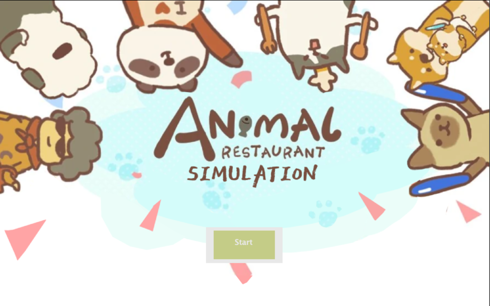
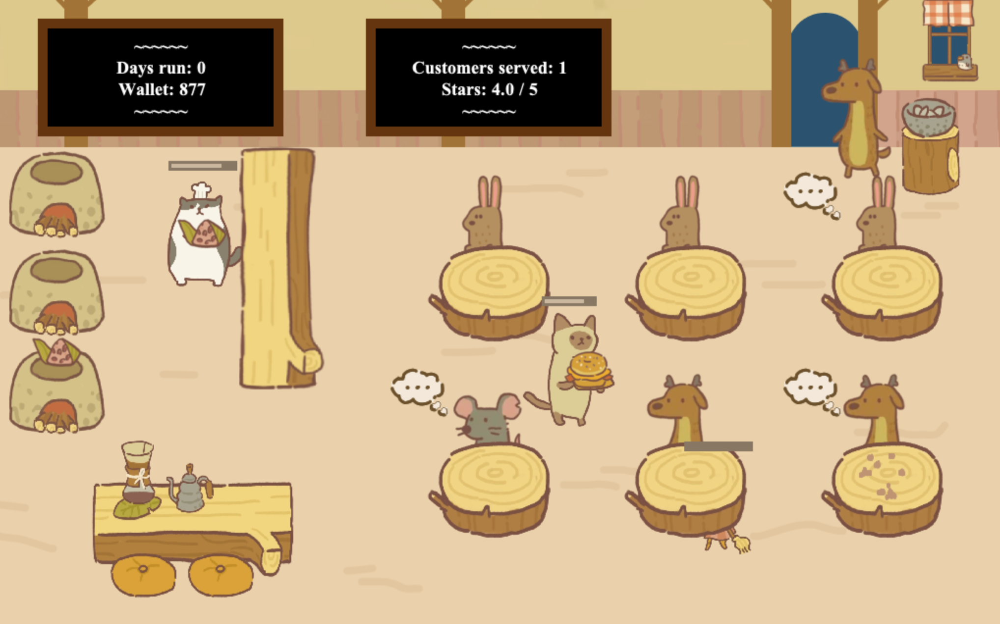

# Animal Restaurant Simulation
 Simulating a cute animal-run restaurant\
 Completed November 2022\
 Group project members: Clara, Joey, Marco 

## Description

This project is a simulation based on the mobile game, Animal Restaurant from DH Games. 
Animal Restaurant characters, food, and furniture design all belong to DH Games, and we take no credit for those designs. 
While there is no gameplay, the goal of the simulation was to illustrate restaurant dynamics and the interactions between the cute animal workers and customers. 

## Installation
This simulation was made on Greenfoot. 
In order for the game to be able to choose the solution word, users must have Greenfoot installed. 
Greenfoot can be installed at:
[https://www.greenfoot.org/download](https://www.greenfoot.org/download) 
\
Once installed, open Greenfoot, click Scenario >> open >> choose folder: GameFiles

To play the simulation, click Run. 

## GamePlay 
Start up the simulation: 
\
 
\
Watch customers and workers interact!: 
\

\

## Image and Sound Credits: 
All design and images belong to the owners of Animal Restaurant, DH Games. 
Image and sound credits can be found in the comments of GameFiles >> "GameWorld.java" 

## How to Contribute

Not accepting contributions. 

